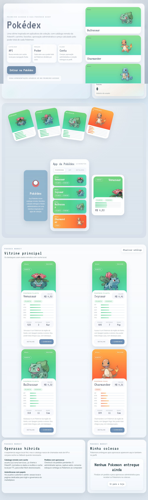
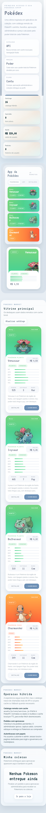

# Pokedex Shop

## Descricao

Marketplace frontend de Pokemons com catalogo remoto, fallback local, autenticacao demonstrativa por papeis, carrinho persistido e fluxo administrativo de pedidos.

## Demonstracao Visual

| Desktop | Mobile |
| --- | --- |
|  |  |

## Funcionalidades

- Catalogo de Pokemons com busca e filtros
- Consumo da PokeAPI com fallback local
- Carrinho persistido por usuario
- Wishlist, perfil e historico
- Login demonstrativo de cliente e administrador
- Aprovacao ou rejeicao de pedidos no painel admin

## Tecnologias

- React
- Vite
- React Router DOM
- Tailwind CSS
- PokeAPI
- localStorage

## Estrutura

- `.gitignore`
- `README.md`
- `assets/`
- `docs/`
- `index.html`
- `netlify.toml`
- `package-lock.json`
- `package.json`
- `src/`
- `tailwind.config.cjs`
- `vite.config.js`

## Requisitos

- Node.js 18 ou superior
- npm

## Instalacao

- npm install

## Variaveis de Ambiente

- Nao utiliza variaveis de ambiente.

## Comandos Disponiveis

| Acao | Comando |
| --- | --- |
| Desenvolvimento | `npm run dev` |
| Build | `npm run build` |
| Preview | `npm run preview` |

## Execucao

Acesse a URL exibida pelo Vite apos executar npm run dev.

## Build

npm run build

## Observacoes

- Credenciais demo: treinador@localhost / pikachu123 e admin@localhost / master123.
- A autenticacao e demonstrativa e o estado e salvo no navegador.

## Autor

Maxsuel Oliveira

## Licenca

Este projeto esta licenciado sob a licenca MIT.
